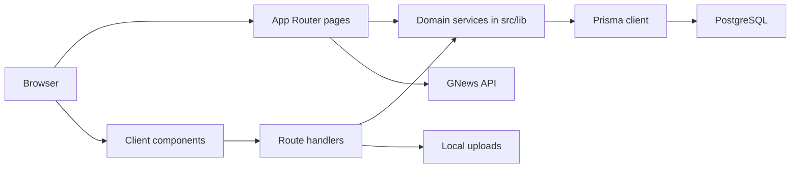
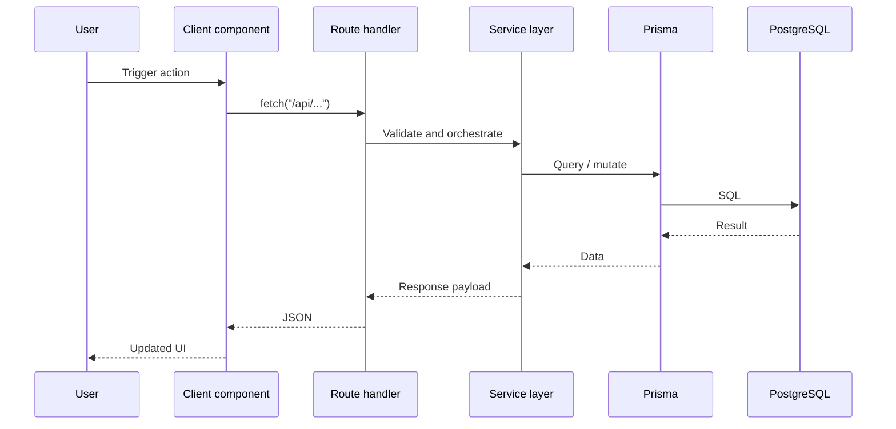

# Architecture

ChessConnect uses a layered Next.js App Router architecture. The app leans on server rendering for page composition, client components for interaction, Prisma for persistence, and route handlers for mutations and authenticated reads.

## System Diagram

## Request Flow

## Main Architectural Decisions

- App Router pages handle navigation, layout composition, and data loading boundaries.
- Route handlers handle authenticated API reads and mutations.
- `src/lib` contains domain logic instead of placing business rules directly inside route handlers.
- Prisma provides access to PostgreSQL, with a generated client committed into the repository output path.
- Uploaded media is validated and written under a writable uploads root (`AVATAR_STORAGE_DIR` for avatars, default `/tmp/uploads/avatars`; posts stay under `public/uploads/posts`), and served via `/api/uploads/...` route handlers.

## Strengths

- Clear split between UI and service logic.
- Easy-to-follow folder structure for a small-to-medium product.
- Route handlers are narrow and practical.
- The current architecture fits product iteration speed well.

## Constraints

- Local upload storage is not ideal for distributed production deployments; avatars in `/tmp` are non-persistent and should move to durable storage.
- Search is database-backed and intentionally lightweight.
- Some presentation rules still live close to pages instead of a fuller design system.
