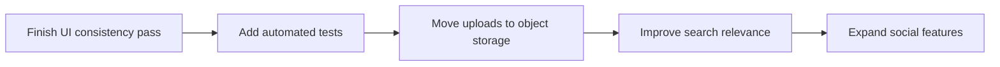

# Next Tasks

## Product

- Add live search suggestions directly in the header.
- Improve post editing with drag-and-drop image reordering.
- Add richer profile activity and post filtering.

## Design

- Introduce a small shared page-layout system for headers, empty states, and section spacing.
- Replace remaining one-off typography usages with reusable utility classes or components.
- Review all modal and form states for accessibility and visual consistency.

## Engineering

- Add automated tests for auth, posts, and follow flows.
- Move media storage to cloud object storage for production readiness.
- Add a dedicated search ranking strategy or indexed search backend if data volume grows.

## Documentation

- Keep `docs/` updated alongside feature work.
- Add API endpoint reference documentation if the project grows further.

## Suggested Delivery Flow

