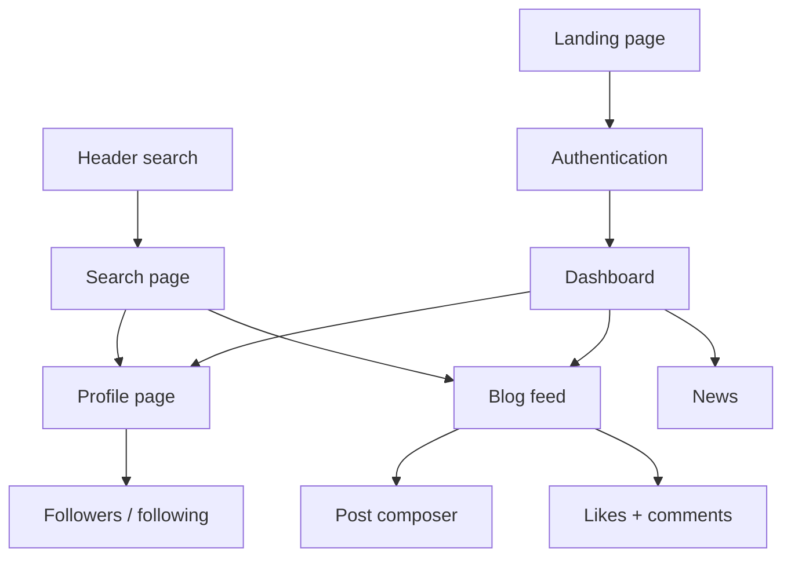

# Project Overview

ChessConnect is a community-oriented chess web application built with Next.js, React, Prisma, and PostgreSQL. The product combines social networking ideas with chess-focused content, giving users one place to publish posts, follow other players, manage profiles, and read curated chess news.

## Goals

- Create a readable and consistent social experience for chess players.
- Support user-generated content through posts, comments, likes, and follow relationships.
- Keep the product approachable for both casual users and more serious improvers.

## Main User Flows

- Register and sign in.
- Edit a profile and upload a custom avatar.
- Open the blog feed and publish posts with up to three images.
- Like posts, comment on them, and react to comments.
- Follow other users and inspect their followers/following lists.
- Search for users and posts.
- Read curated chess news.

## Product Map

## Tech Stack

- Next.js 16 App Router
- React 19
- TypeScript
- Prisma 7
- PostgreSQL
- Tailwind CSS 4

## Current State

The application already supports the core social and profile flows. Most improvements now sit in consistency, polish, and long-term maintainability rather than in basic product scaffolding.

Recent polish:
- Layout constrained to 1440px with centered header search for consistent rhythm.
- Comment modal shows author links and relative timestamps; broken post images fall back to a bundled 404 illustration.
- Error messages share a unified red color token across the app.
- Avatar uploads now write to a writable path (`/tmp/uploads/avatars` by default) to work in read-only serverless environments.
