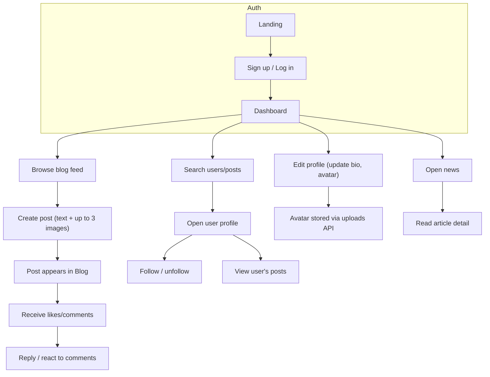

# User Flows

Common end-to-end paths a signed-in user takes in ChessConnect.

- Auth: sign up or log in to reach the dashboard.
- Profile: edit bio and upload avatar (stored through `/api/uploads/avatars/...`).
- Posting: create posts with images; others can like or comment; comments include author links and timestamps.
- Search: find users or posts, open profiles, follow/unfollow, read their posts.
- News: browse curated chess news and open article pages.
